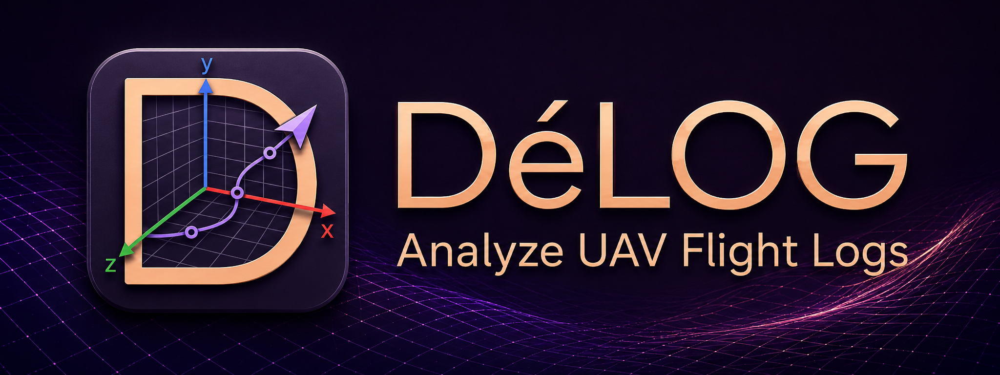

<p align="center">
  
</p>

# DéLOG

DéLOG is a fast, GPU-accelerated **drone flight-log and live-telemetry analyzer**.
It reads the formats real autopilots produce (PX4, ArduPilot, QGroundControl), and
when a format or a derived signal isn't built in, you extend it in Python - both file
parsers and analysis scripts - without recompiling.

## Features

- **Drag-and-drop UI** - drop a log file anywhere on the window to load it; arrange plots
  in a tiling workspace that persists across sessions.
- **Multiple log formats** - PX4 ULog (`.ulg`), ArduPilot (`.BIN`), and QGroundControl
  MAVLink telemetry (`.tlog`), with automatic format sniffing and a manual-override picker.
- **Live MAVLink telemetry** - stream from a vehicle over UDP, TCP, or serial through the
  same ingest path as files, and record incoming frames to a `.tlog`.
- **Custom parsers** - add Python parsers for formats DéLOG doesn't ship, defining a single
  `Parse(raw_data)` function. See [docs/custom_parsers.md](docs/custom_parsers.md).
- **Custom scripts** - embedded CPython + NumPy for derived fields and live transforms;
  results plot exactly like parsed data. See [docs/scripting.md](docs/scripting.md).
- **Fast WGPU visualization** - GPU-rendered line/scatter/step plots with automatic
  decimation for million-point series, plus a 3D trajectory view with vehicle models.

### Noteworthy

- **Live and offline share one path.** A live MAVLink stream and a recorded `.tlog`
  round-trip through identical decoding code, so what you see live is what you replay.
- **Extend it in Python, no rebuild.** Custom parsers and analysis scripts are plain `.py`
  files in your config directory - edit them in any editor and they appear in the menus.
- **Real CPython, not a sandboxed subset.** Scripts get the full interpreter with NumPy
  (and SciPy/Bottleneck/CFFI when installed), so derived-field math is just NumPy.
- **Single binary.** Shaders, 3D models, and the color palette are embedded at build time;
  a stripped binary always renders.

## Quickstart

```bash
# Build and run (embedded Python scripting is on by default)
cargo run -p delog-app

# Build without Python - no interpreter or dev headers required
cargo run -p delog-app --no-default-features
```

Scripting embeds CPython via `pyo3`, so the default build needs a Python 3 toolchain
(interpreter + dev headers). Disabling the default feature drops that requirement entirely.
See [docs/scripting.md](docs/scripting.md#enabling-scripting) for interpreter-pinning tips.

## Scripting (overview)

DéLOG runs Python scripts that read the loaded dataset and **emit new fields and topics** -
derived signals that flow through the normal ingestion path and plot like log data. There
are two modes: **snapshot scripts** that run once against the current data, and **live
transforms** (`@delog.live_transform`) that append derived fields as telemetry arrives. A
Console window provides an editor and a persistent REPL.

Bundled examples live in [`scripts/`](scripts/). Full API reference and examples:
**[docs/scripting.md](docs/scripting.md)**.

## Custom parsers (overview)

When DéLOG's built-in parsers don't cover a format, add a Python parser under
**Tools ▸ Parsers**. The file receives the raw bytes as a NumPy `float32` array and returns
`(field_name, values, tooltip)` triples that become topics and fields. Full guide:
**[docs/custom_parsers.md](docs/custom_parsers.md)**.

## Documentation

- [Scripting](docs/scripting.md) - embedded-Python derived fields, the `delog` API, live transforms.
- [Custom parsers](docs/custom_parsers.md) - Python file parsers via `Parse(raw_data)`.

## License

DéLOG is released under the [MIT License](LICENSE.md).
