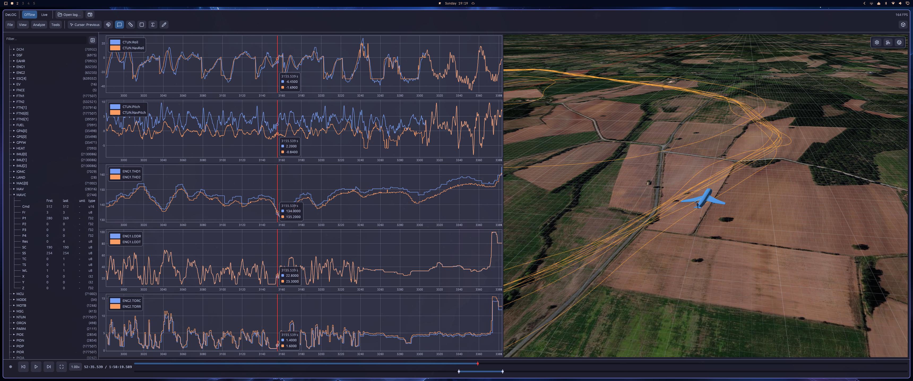

# DéLOG

DéLOG is a fast, GPU-accelerated **drone flight-log and live-telemetry analyzer**.
It supports PX4 ULog, ArduPilot BIN, and MAVLink telemetry logs from QGroundControl
or Mission Planner, and when a format or a derived signal isn't built in, you extend
it in Python - both file parsers and analysis scripts - without recompiling.




## Features

- **Multiple log formats** - PX4 ULog (`.ulg`), ArduPilot (`.BIN`), MAVLink
  telemetry logs (`.tlog`) from QGroundControl or Mission Planner, and Parquet files,
  with automatic format sniffing and a manual-override picker. Structured DéLOG Parquet
  files open automatically; generic Parquet files prompt for a timestamp field and unit.
- **Live MAVLink telemetry** - stream from a vehicle over UDP, TCP, or serial through the
  same ingest path as files, and record incoming frames to a `.tlog`.
- **Custom parsers** - add Python parsers for formats DéLOG doesn't ship, defining a single
  `Parse(raw_data)` function. See [docs/custom_parsers.md](docs/custom_parsers.md).
- **Custom scripts** - embedded CPython + NumPy for derived fields and live transforms;
  results plot exactly like parsed data, and top-level scripts can control plots,
  annotations, vehicles, markers, and layouts. See
  [docs/scripting.md](docs/scripting.md) and [docs/app_control.md](docs/app_control.md).
- **Visual dataflows** - build and save derived numeric signals with a node graph, no
  Python required. See [docs/dataflow.md](docs/dataflow.md).
- **Fast WGPU visualization** - GPU-rendered line/scatter/step plots with automatic
  decimation for million-point series, plus a 3D trajectory view with vehicle models.


## Installation

Download the latest release from [GitHub Releases](https://github.com/HmZyy/DeLOG/releases/latest).

- **Windows:** use the bundled setup executable, or download a portable ZIP.
- **Linux:** use the AppImage, or download and extract a tarball.
- Builds ending in `-no-scripting` do not require Python.
- For builds that use a local Python installation, install
  [Python 3.12.3](https://www.python.org/downloads/release/python-3123/).

### Build from source

Install [Rust via rustup](https://rustup.rs/). For scripting builds, also install
Python 3.12.3 with its development headers. The repository selects the required
Rust version automatically.

Clone and build DeLOG:

```bash
git clone https://github.com/HmZyy/DeLOG.git
cd DeLOG
cargo build --release --locked -p delog-app
```

The executable is `target/release/delog` on Linux or
`target\release\delog.exe` on Windows. To build without Python scripting:

```bash
cargo build --release --locked -p delog-app --no-default-features
```

## Documentation

- [Dataflow editor](docs/dataflow.md) - visual derived signals, timeline alignment, and publishing.
- [Scripting](docs/scripting.md) - embedded-Python derived fields, the `delog` API, live transforms.
- [Python app control](docs/app_control.md) - plots, annotations, vehicles, markers, layouts, and atomic batches.
- [Custom parsers](docs/custom_parsers.md) - Python file parsers via `Parse(raw_data)`.

## License

DéLOG is released under the [MIT License](LICENSE.md).
